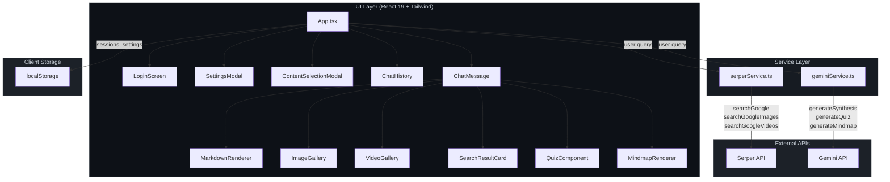
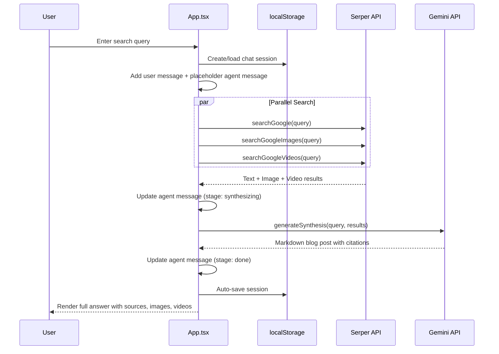

<div align="center">
</div>

# Research Agent Pro

**Research Agent Pro** is a Perplexity-style AI research assistant that searches the web in real-time via **Serper API** and synthesizes comprehensive, blog-quality answers using **Google Gemini Flash**. Built with React 19, TypeScript and Vite.

## Features

- **Web Search & Synthesis** -- Ask any question, the agent searches Google (text, images, videos) in parallel, then synthesizes a cited, well-structured answer via Gemini Flash.
- **Chat History** -- All conversations are automatically saved to localStorage. Rename, delete, or resume any past session from the sidebar.
- **Quiz Generation** -- Auto-generate multiple-choice quizzes from any research result to test comprehension.
- **Mindmap Generation** -- Visualize key concepts as interactive mindmaps powered by markmap.js.
- **Multi-language & Region** -- Configure search country and language (default: Vietnam / Vietnamese).
- **Dark / Light Theme** -- Toggle between themes, preference is persisted.
- **Session Auth & Settings** -- Simple login gate with per-user API key management stored in localStorage.

## Architecture



## Data Flow



## Project Structure

```
Research-Agent/
├── App.tsx              # Main app: state, auth, history, routing, handlers
├── index.tsx            # React entry point
├── index.html           # HTML shell
├── types.ts             # TypeScript interfaces (Message, Settings, ChatSession, etc.)
├── constants.ts         # Default settings, Gemini models, country/language options
├── components/
│   ├── ChatHistory.tsx          # Sidebar: list, rename, delete past sessions
│   ├── ChatMessage.tsx          # Single message bubble (text + media + actions)
│   ├── ContentSelectionModal.tsx # Modal to pick a message for quiz/mindmap
│   ├── ImageGallery.tsx         # Grid display for image results
│   ├── VideoGallery.tsx         # Grid display for video results
│   ├── LoginScreen.tsx          # Auth gate
│   ├── MarkdownRenderer.tsx     # Renders markdown with remark-gfm
│   ├── MindmapRenderer.tsx      # Interactive mindmap via markmap
│   ├── QuizComponent.tsx        # Interactive quiz UI
│   ├── SearchResultCard.tsx     # Single search result card
│   └── SettingsModal.tsx        # API keys, model, temperature, region
├── services/
│   ├── serperService.ts   # Serper API: text, image, video search
│   └── geminiService.ts   # Gemini API: synthesis, quiz, mindmap
├── package.json
├── tsconfig.json
└── vite.config.ts
```

## Tech Stack

| Layer | Technology |
|-------|-----------|
| Framework | React 19 + TypeScript |
| Build | Vite 6 |
| Styling | Tailwind CSS |
| Icons | Lucide React |
| Markdown | react-markdown + remark-gfm |
| Mindmap | markmap-lib + markmap-view + D3 |
| Search API | Serper Dev (Google Search) |
| LLM API | Google Gemini Flash (gemini-2.0-flash default) |

## Getting Started

**Prerequisites:** Node.js 18+

1. Install dependencies:
   ```bash
   npm install
   ```

2. Run the development server:
   ```bash
   npm run dev
   ```

3. Open the app, go to **Settings**, and enter your **Gemini API Key** and **Serper API Key**.

   - Get a Gemini API key at [ai.google.dev](https://ai.google.dev)
   - Get a Serper API key at [serper.dev](https://serper.dev)

## License

This project is open source.
